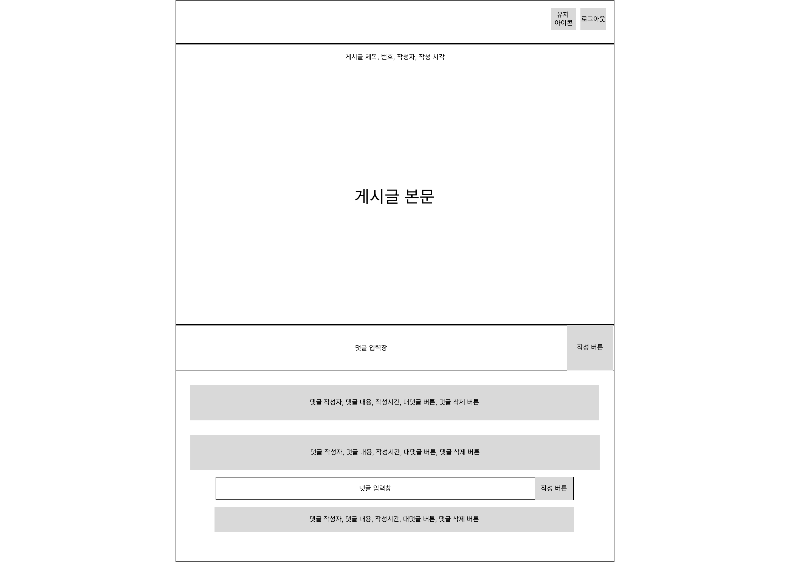

# graphql 배우기

## 클라이언트 구조

#### Requirement

- 하나의 게시글에 붙어있는 대댓글들을 구현하고자 함.
- 로그인의 경우 게스트네임으로 로그인되게 구성.
- 댓글과 댓글에 댓글을 붙이는 대댓글로 구성.

  - 따라서 댓글에는 자신이 붙어있는 위치를 가르킬수있는 변수가 필요함.

- 댓글의경우 생성, 수정, 삭제가 가능하게 구성.

- 대댓글의 크기는 댓글의 80% ~ 90% 정도로 가정

#### WireFrame

<p align="center"></p>

#### stack

- react
- styled-component
- graphql-hooks // 사용해보자

## DB //아직 미정

### 예상 스키마

- user // 특별히 많은 정보는 필요 없으리라 생각함.

```js
{
  id: number || ObjectId; // 아직 db 타입을 결정 하지 않음.
  userName: string;
}
```

- article // 게시글

```js
{
  id: number || ObjectId; // 아직 db 타입을 결정 하지 않음.
  writerId: number || ObjectId; //작성한 유저 아이디
  contents: string; //게시글 내용, 내용은 주용치 않으니 더미값으로
  createdAt: Date; //생성 시각
  updatedAt: Date; //수정 시작
}
```

- comment

```js
{
  id: number || ObjectId; // 아직 db 타입을 결정 하지 않음.
  writerId: number || ObjectId; //작성한 유저 아이디
  relateId: number || ObjectId; //상위 요소 아이디 (게시글이거나 댓글이거나)
  comment: string; //댓글 내용
  createdAt: Date; //생성 시각
  updatedAt: Date; //수정 시작
}
```

## 서버

#### stack

- graphql - 이번 학습의 목표
- express - 뭐 가장 많이 써보긴한것 같으니
  그다음은 뭐가 필요한지 아직 모르겠다.

#### Reference

[학습 참고 링크](https://yuddomack.tistory.com/entry/expressgraphql%EC%97%90-mongodb-%EC%82%AC%EC%9A%A9%ED%95%98%EA%B8%B0)
